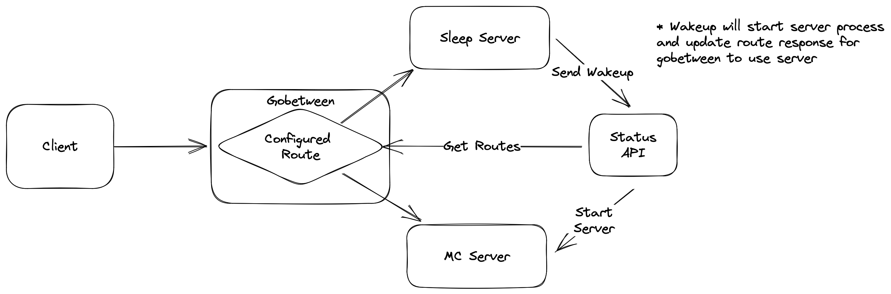

# Sleepy Steve

A minecraft server sleep solution.

## About

I love playing minecraft with friends. I like playing minecraft with mods. I don't like forgetting 
to turn off the server. Scheduled shutdowns mean people get kicked off if theyre online. I also 
don't like others needing to wait for me to turn on my server when I'm away.

There are a few different solutions to this. One of the most common being bungeecord with queue 
plugins. The downside there is it is a mod for the server, meaning you have to worry about 
compatability with other mods and IMO the whole setup is pretty cumbersome and far behind on
updates.

Sleepy Steve seeks to solve this problem but letting everything do what it does best. Put simply,
Sleepy Steve is a trio of applications deployed together that allows for the server to shutdown 
when no one's on, and automatically wake up when people try to connect!

## Program Flow

TL;DR: 
    * Gobetween routes the connection to either the Sleep Server or the Live Server.
    * Gobetween gets its routes from Sleepy Steve API
    * The Sleep Server accepts logins and lets The Sleepy Steve API know before kicking the player
      telling them the server is waking up and to check back in a minute.
    * Sleepy Steve API starts the server and updates it's routes
    * Sleepy Steve API monitors the live server and shuts it down when no one is on, restarting the
      Sleep Server and updating routes.

Exposition Coming Soon:tm: